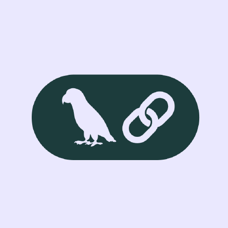

## Hey 👋, I'm Swaminathan!
  
  &emsp;
  

MCA graduate specializing in Python, machine learning, and large language models. Passionate about AI/ML 🤖, Art 🎨, Competetive coding 💻, Building various projects 🛠️. 

 

### 🧐 More About Me:

- 🔭 &nbsp; Currently working on a **Sales Dashboard with Predictive Insights**
- 🌱 &nbsp; Learning more about **Data Analytics**
- 👨🏻‍💻 &nbsp; Most of my projects are available on [GitHub](https://github.com/Swamibhuvanesan?tab=repositories)
- 🤖 &nbsp; I enjoy building AI characters on platforms like Charhub and Janitor
- 🎨 &nbsp; I love sketching anime characters — and occasionally real people
- 💬 &nbsp; Always happy to connect or chat about data, AI, or tech in general
- 📫 &nbsp; Reach out via [LinkedIn](https://www.linkedin.com/in/swami--nathan/)
- 📝 &nbsp; Check out my [Portfolio](https://swamibhuvanesan.github.io/Portfolio/)

 

### 🔨 Languages and Tools:

 
 

### 🛠️ My Projects

 
 
 
 
 

  Made with ❤️ by Swaminathan

